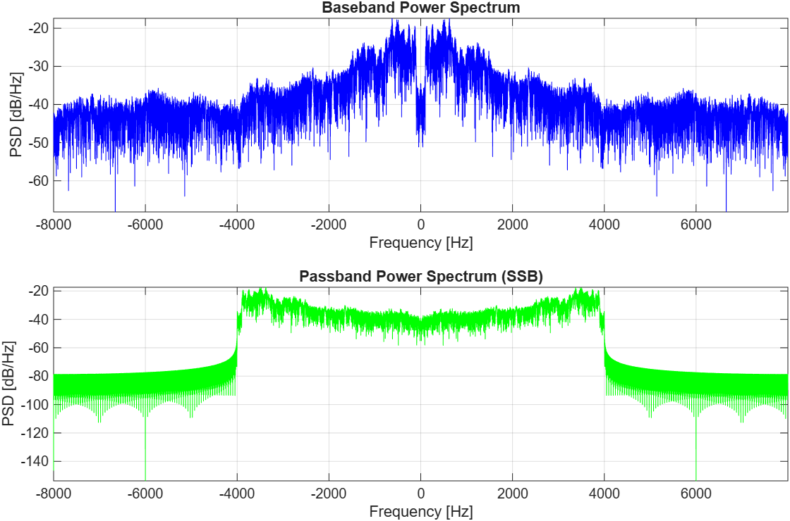
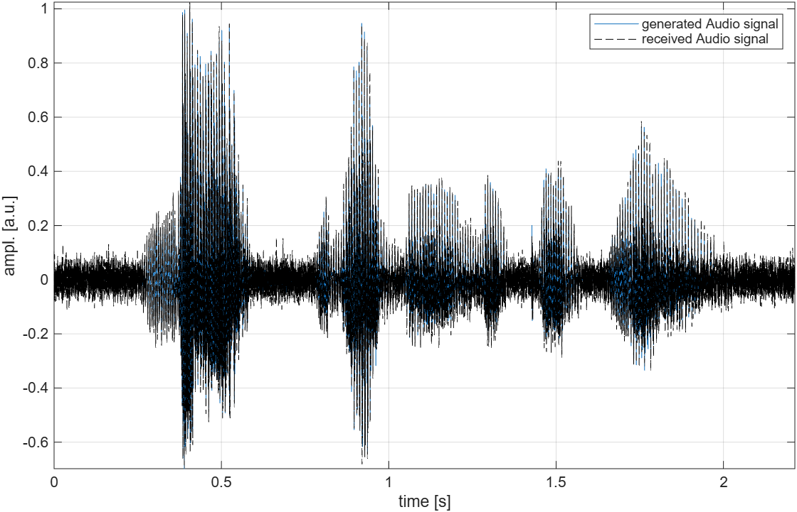

# SSB Modulation and AWGN Channel Simulation

This repository contains a MATLAB simulation of an analog communication system using Single Sideband (SSB) modulation over an Additive White Gaussian Noise (AWGN) channel. 

**Author:** Sérgio Luiz Carneiro Junior  
**Institution:** Universidade Federal do Espírito Santo (UFES)  
**Course:** Principles of Communication (Prof. Jair Silva)  
**Date:** June 2026  

## Project Overview
This laboratory exam evaluates the performance of AM modulation techniques. The simulation performs the following tasks:
1. Takes a human voice audio file as the modulating baseband signal.
2. Modulates the signal using SSB (the most efficient AM modulation in terms of spectral occupancy and energy).
3. Transmits the signal through a noisy AWGN channel with a specified Signal-to-Noise Ratio (SNR).
4. Demodulates the received signal.
5. Calculates the Mean Squared Error (MSE) to evaluate the continuous waveform distortion caused by the channel.

## Repository Structure
* `src/`: Contains the main MATLAB script (`ssb_simulation.m`) and the custom FFT function (`Spectrum_Analyzer.m`).
* `data/`: Contains the generic test `.ogg` audio file used for modulation.
* `results/`: Contains output plots illustrating system performance.

## Simulation Results

### 1. Spectral Analysis

*Comparison between the baseband power spectrum and the passband power spectrum.*

### 2. Time Domain Analysis

*Comparison between the generated audio signal and the received audio signal after channel transmission.*

## How to Run
1. Clone this repository to your local machine.
2. Open MATLAB and ensure your Current Folder is the root of the cloned repository.
3. Open the `src/` folder and run `ssb_simulation.m`. 
> **Note:** The script relies on the relative path `../data/test_audio.ogg`, so ensure you run it from within the `src/` directory.
